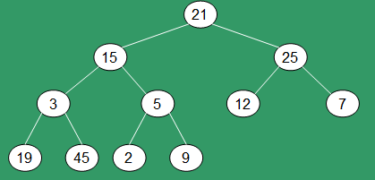
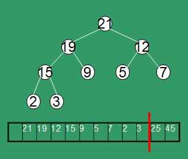
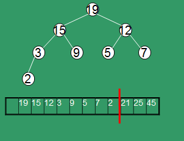
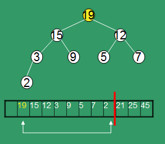
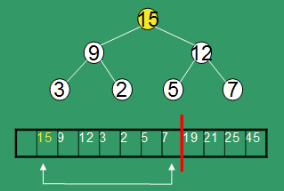
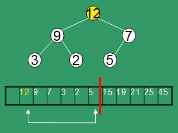

.. title:: Sorting

:css: css/lecture_style2.css
:data-transition-duration: 500

------------------------------------------------

All sorts of sorts
==================

------------------------------------------------

LOTS of different sorts.

Can you name a few?

------------------------------------------------

Sorts we will cover:

* Bubble
* Selection
* Insertion
* Shell
* Heap
* Merge
* Quick

------------------------------------------------

Bubble Sort
===========

* As a buble will float to the surface
* We sort the "bubbles" as the largest element to the right
* Adjacent elements are compared and swapped
* Since each element has to be bubbled to the right multiple passes must be done

------------------------------------------------

.. image:: figures/sorts/bubble.gif

------------------------------------------------

.. image:: figures/sorts/bubble.png

------------------------------------------------

.. image:: figures/sorts/bubbleFlowChart.jpg

------------------------------------------------

Bubble Algorithmn
=================

.. code:: 

    BubbleSort
        Loop n times
            Loop n – 1 times
                If array(i) > array(i + 1)
                    Swap (array[i], array(i + 1)
                End If
            End Loop
        End Loop
    End BubbleSort

**What is the big O notation?**
**How can we improve this algorithmn**

------------------------------------------------

Bubble Algorithmn
=================

Keep track of the the last element:

.. code:: 

    BubbleSort
        Loop n times keep track of the pass number
            Loop n – pass - 1 times
                If array(i) > array(i + 1)
                    Swap (array[i], array(i + 1)
                End If
            End Loop
        End Loop
    End BubbleSort

**Can we make this better?**

------------------------------------------------

If the list is already sorted we don't need to loop

.. code:: 

	BubbleSort
        Loop n times keep track of the pass number
        if sorted equals true - quit
            Set sorted = true
            Loop n – pass - 1 times
                If array(i) > array(i + 1)
                    sorted = false
                    Swap (array[i], array(i + 1)
                End If
            End Loop
        End Loop
    End BubbleSort

------------------------------------------------

No matter what you do the worst case for bubble sort is always o(n^2)

------------------------------------------------

flagged bubble sort is somewhat efficient in best case scenarios

If the list is already sorted: O(n)

------------------------------------------------

Selection Sort
==============

* In a selection sort we find the largest value and place it at the end of the array

* We then take the largest number from what remains and repeat.

* Continue this process until no values remain.

------------------------------------------------

+--------+----+----+----+----+
| **12** | 5  | 9  | 1  | 2  |
+--------+----+----+----+----+

MAX: 12

------------------------------------------------

+--------+--------+--------+--------+--------+
| **2**  |    5   |    9   |    1   | **12** |
+--------+--------+--------+--------+--------+

------------------------------------------------

+--------+--------+--------+--------+--------+
|   2    |    5   | **9**  |    1   |   12   |
+--------+--------+--------+--------+--------+

MAX: 9

------------------------------------------------

+--------+--------+--------+--------+--------+
|   2    |    5   | **1**  | **9**  |   12   |
+--------+--------+--------+--------+--------+

------------------------------------------------

+--------+--------+--------+--------+--------+
|   2    | **5**  |   1    |   9    |   12   |
+--------+--------+--------+--------+--------+

MAX: 5

------------------------------------------------

+--------+--------+--------+--------+--------+
|   2    | **1**  | **5**  |   9    |   12   |
+--------+--------+--------+--------+--------+

------------------------------------------------

+--------+--------+--------+--------+--------+
| **2**  |   1    |   5    |   9    |   12   |
+--------+--------+--------+--------+--------+

MAX: 2

------------------------------------------------

+--------+--------+--------+--------+--------+
| **1**  |   2    |   5    |   9    |   12   |
+--------+--------+--------+--------+--------+

------------------------------------------------

Algorithmn
==========

.. code::

    SelectionSort
        For i = 0, i < n - 1
            For j = i+ 1, max = i, j < n
                if array(j) > array(max)
                max = j
            End Loop
            Swap array(j) and array(max)
        End Loop
    End Selection
    
What is the big O Notation?

------------------------------------------------

Selection Sort
==============

* This is O(n^2)

------------------------------------------------

Selection Sort
==============

* An array of 1 is a sorted array
* We start with the first element and insert the rest in order

------------------------------------------------

.. code::

    For I = 1 to N
        J = I
        Do while (J > 1) and (A(J) < A(J - 1)
            Temp = A(J)
            A(J) = A(J - 1)
            A(J - 1) = Temp
            J = J - 1 
       End-Do
    End-For
    
------------------------------------------------

So what is the big O notation?

------------------------------------------------

**STILL O(n^2)**

------------------------------------------------

So why learn these three sorts?

------------------------------------------------

Even though they all have the same big O notation bubble sort is probably the slowest

**Number of Compares:**

+--------+-----------+
| insert | n(n-1)/4  |
+--------+-----------+
| select | n(n-1)/2  |
+--------+-----------+
| bubble | n(n-1)/2  |
+--------+-----------+

------------------------------------------------

More efficent sorts
===================

* The sorts we've covered so far are somewhat simple
* The previous sorts are also very inefficent

------------------------------------------------

Shell Sort
==========

* Slightly better on efficiency. 
* Far more complicated to understand
* Named after Donald L. Shell

------------------------------------------------

Shell Sort
==========

* Basic idea we break the data into sub components
* The sub arrays are then sorted
* The original array is then broken into smaller sub-arrays
* sort again!

------------------------------------------------

Shell Sort
==========

What size do we make the chunks?

------------------------------------------------

Shell Sort
==========

It doesn't matter the size as long as we end with 1.

* Don't use increments like 1, 2, 4, 8, 16
* It's less beneficial if the elements of sub-arrays mix together

------------------------------------------------

Shell Sort
==========

Adam Drozdek suggests h(1) = 1; h(i+1) = 3h(i) + 1.

------------------------------------------------

This means if N = 10000 out sequence would be:

+---------+
|    1    |
+---------+
|    4    |
+---------+
|   13    |
+---------+
|   40    | 
+---------+
|  121    |
+---------+
|  364    | 
+---------+
|  1093   |
+---------+
|  3280   |
+---------+

------------------------------------------------

There are three features that vary from one implementation to another:

* The sequence of increments
* A simple sort applied to all passes except the last
* A simple sort applied to the last pass

Shell used an insertion sort for all passes

A 5-sort is when the array is broken into 5 sub-arrays

------------------------------------------------

+----+----+----+----+----+----+----+----+----+----+----+
| 10 | 8  |  6 | 20 | 4  | 3  | 22 | 1  | 0  | 15 | 16 |
+----+----+----+----+----+----+----+----+----+----+----+

------------------------------------------------

+--------+--------+--------+--------+--------+--------+--------+--------+--------+--------+--------+
| **10** | 8      |  6     | 20     | 4      |  **3** | 22     | 1      | 0      | 15     | **16** |
+--------+--------+--------+--------+--------+--------+--------+--------+--------+--------+--------+

+----+----+----+
| 10 | 3  | 16 |
+----+----+----+

+----+----+----+
| 3  | 10 | 16 |
+----+----+----+

------------------------------------------------

+--------+--------+--------+--------+--------+--------+--------+--------+--------+--------+--------+
| **3**  | 8      |  6     | 20     | 4      | **10** | 22     | 1      | 0      | 15     | **16** |
+--------+--------+--------+--------+--------+--------+--------+--------+--------+--------+--------+

------------------------------------------------

+--------+--------+--------+--------+--------+--------+--------+--------+--------+--------+--------+
|   3    | **8**  |  6     | 20     | 4      |   10   | **22** | 1      | 0      | 15     |   16   |
+--------+--------+--------+--------+--------+--------+--------+--------+--------+--------+--------+

+----+----+
| 8  | 22 |
+----+----+
| 8  | 22 |
+----+----+

------------------------------------------------

+--------+--------+--------+--------+--------+--------+--------+--------+--------+--------+--------+
|   3    | **8**  |  6     | 20     | 4      |   10   | **22** | 1      | 0      | 15     |   16   |
+--------+--------+--------+--------+--------+--------+--------+--------+--------+--------+--------+

------------------------------------------------

+--------+--------+--------+--------+--------+--------+--------+--------+--------+--------+--------+
|   3    |   8    |  **6** | 20     | 4      |   10   |   22   | **1**  | 0      | 15     |   16   |
+--------+--------+--------+--------+--------+--------+--------+--------+--------+--------+--------+

+----+----+
| 6  | 1  |
+----+----+
| 1  | 6  |
+----+----+

------------------------------------------------

+--------+--------+--------+--------+--------+--------+--------+--------+--------+--------+--------+
|   3    |   8    |  **1** | 20     | 4      |   10   |   22   | **6**  | 0      | 15     |   16   |
+--------+--------+--------+--------+--------+--------+--------+--------+--------+--------+--------+

------------------------------------------------

+--------+--------+--------+--------+--------+--------+--------+--------+--------+--------+--------+
|   3    |   8    |    1   | **20** | 4      |   10   |   22   |   6    | **0**  | 15     |   16   |
+--------+--------+--------+--------+--------+--------+--------+--------+--------+--------+--------+

+----+----+
| 20 | 0  |
+----+----+
| 0  | 20 |
+----+----+

------------------------------------------------

+--------+--------+--------+--------+--------+--------+--------+--------+--------+--------+--------+
|   3    |   8    |    1   | **0**  | 4      |   10   |   22   |   6    | **20** | 15     |   16   |
+--------+--------+--------+--------+--------+--------+--------+--------+--------+--------+--------+

------------------------------------------------

+--------+--------+--------+--------+--------+--------+--------+--------+--------+--------+--------+
|   3    |   8    |    1   | 0      | **4**  |   10   |   22   |   6    | 20     | **15** |   16   |
+--------+--------+--------+--------+--------+--------+--------+--------+--------+--------+--------+

+----+----+
| 4  | 15 |
+----+----+
| 4  | 15 |
+----+----+

------------------------------------------------

+--------+--------+--------+--------+--------+--------+--------+--------+--------+--------+--------+
|   3    |   8    |    1   | 0      | **4**  |   10   |   22   |   6    | 20     | **15** |   16   |
+--------+--------+--------+--------+--------+--------+--------+--------+--------+--------+--------+

------------------------------------------------

+--------+--------+--------+--------+--------+--------+--------+--------+--------+--------+--------+
|   3    |   8    |    1   | 0      |   4    |   10   |   22   |   6    | 20     |   15   |   16   |
+--------+--------+--------+--------+--------+--------+--------+--------+--------+--------+--------+

------------------------------------------------

+--------+--------+--------+--------+--------+--------+--------+--------+--------+--------+--------+
| **3**  |   8    |    1   | **0**  |   4    |   10   | **22** |   6    | 20     | **15** |   16   |
+--------+--------+--------+--------+--------+--------+--------+--------+--------+--------+--------+

+----+----+----+----+
| 3  | 0  | 22 | 15 |
+----+----+----+----+
| 0  | 3  | 15 | 20 |
+----+----+----+----+

------------------------------------------------

+--------+--------+--------+--------+--------+--------+--------+--------+--------+--------+--------+
| **0**  |   8    |    1   | **3**  |   4    |   10   | **15** |   6    | 20     | **20** |   16   |
+--------+--------+--------+--------+--------+--------+--------+--------+--------+--------+--------+

------------------------------------------------

+--------+--------+--------+--------+--------+--------+--------+--------+--------+--------+--------+
|   0    | **8**  |    1   |   3    | **4**  |   10   |   15   | **6**  | 20     |   20   | **16** |
+--------+--------+--------+--------+--------+--------+--------+--------+--------+--------+--------+

+----+----+----+----+
| 8  | 4  | 6  | 16 |
+----+----+----+----+
| 4  | 6  | 8  | 16 |
+----+----+----+----+

------------------------------------------------

+--------+--------+--------+--------+--------+--------+--------+--------+--------+--------+--------+
|   0    | **4**  |    1   |   3    | **6**  |   10   |   15   | **8**  | 20     |   20   | **16** |
+--------+--------+--------+--------+--------+--------+--------+--------+--------+--------+--------+

------------------------------------------------

+--------+--------+--------+--------+--------+--------+--------+--------+--------+--------+--------+
|   0    |   4    |  **1** |   3    |   6    | **10** |   15   |   8    | **20** |   20   |   16   |
+--------+--------+--------+--------+--------+--------+--------+--------+--------+--------+--------+

+----+----+----+
| 1  | 10 | 20 |
+----+----+----+
| 1  | 10 | 20 |
+----+----+----+

------------------------------------------------

+--------+--------+--------+--------+--------+--------+--------+--------+--------+--------+--------+
|   0    |   4    |    1   |   3    |   6    |   10   |   15   |   8    |   20   |   20   |   16   |
+--------+--------+--------+--------+--------+--------+--------+--------+--------+--------+--------+

------------------------------------------------

Now with 1

+--------+--------+--------+--------+--------+--------+--------+--------+--------+--------+--------+
|   0    | **4**  | **1**  |   3    |   6    |   10   |   15   |   8    |   20   |   20   |   16   |
+--------+--------+--------+--------+--------+--------+--------+--------+--------+--------+--------+

+--------+--------+--------+--------+--------+--------+--------+--------+--------+--------+--------+
|   0    | **1**  | **4**  |   3    |   6    |   10   |   15   |   8    |   20   |   20   |   16   |
+--------+--------+--------+--------+--------+--------+--------+--------+--------+--------+--------+

+--------+--------+--------+--------+--------+--------+--------+--------+--------+--------+--------+
|   0    |   1    | **4**  | **3**  |   6    |   10   |   15   |   8    |   20   |   20   |   16   |
+--------+--------+--------+--------+--------+--------+--------+--------+--------+--------+--------+

+--------+--------+--------+--------+--------+--------+--------+--------+--------+--------+--------+
|   0    |   1    | **3**  | **4**  |   6    |   10   |   15   |   8    |   20   |   20   |   16   |
+--------+--------+--------+--------+--------+--------+--------+--------+--------+--------+--------+

**ETC**

------------------------------------------------

+--------+--------+--------+--------+--------+--------+--------+--------+--------+--------+--------+
|   0    |   1    |   3    |   4    |   6    | 8      |   10   |  15    |   16   |   20   |   20   |
+--------+--------+--------+--------+--------+--------+--------+--------+--------+--------+--------+

------------------------------------------------

Increment Creation
==================

.. code::

    For h = 1, i = 0, h < n
        gaps(i) = h
        h = 3 * h + 1
        reverse(gaps)

------------------------------------------------

Sorting
=======

.. code:: 

    # Start with the largest gap and work down to a gap of 1
    foreach (gap in gaps)
    {
        # Do a gapped insertion sort for this gap size.
        # The first gap elements a[0..gap-1] are already in gapped order
        # keep adding one more element until the entire array is gap sorted
        for (i = gap; i < n; i += 1)
        {
            # add a[i] to the elements that have been gap sorted
            # save a[i] in temp and make a hole at position i
            temp = a[i]
            # shift earlier gap-sorted elements up until the correct location for a[i] is found
            for (j = i; j >= gap and a[j - gap] > temp; j -= gap)
            {
                a[j] = a[j - gap]
            }
            # put temp (the original a[i]) in its correct location
            a[j] = temp
        }
    }

------------------------------------------------

Shell Sort Analysis
===================

Previous sorts: O(n^2)
Shell Short: O(n^1.25)

+--------+--------------+---------------+----------------+
|        | 100 Elements | 1000 Elements | 10000 Elements |
+========+==============+===============+================+
| n^2    | 10,000       | 1,000,000     | 100,000,000    |
+--------+--------------+---------------+----------------+
| n^1.25 | 316          | 5,623         | 100,000        |
+--------+--------------+---------------+----------------+

------------------------------------------------

Merge Sort
==========

Merge sort works by splitting an array into halves then merging the elements back together

------------------------------------------------

Merge Sort Steps
================

* Split the array in half
* Sort the sub arrays by continually breaking them down 
* Merge the sub arrays back together

------------------------------------------------

+----+----+----+----+----+----+
| 10 | 8  | 6  | 20 | 4  | 3  |
+----+----+----+----+----+----+

+----+----+----+
| 10 | 8  | 6  |
+----+----+----+

+----+----+
| 10 | 8  |
+----+----+

+----+----+
| 8  | 10 |
+----+----+

+----+----+----+
| 6  | 8  | 10 |
+----+----+----+

------------------------------------------------

+----+----+----+----+----+----+
| 10 | 8  | 6  | 20 | 4  | 3  |
+----+----+----+----+----+----+

+----+----+----+
| 20 | 4  | 3  |
+----+----+----+

+----+----+
| 20 | 4  |
+----+----+

+----+----+
| 4  | 20 |
+----+----+

+----+----+----+
| 3  | 4  | 20 |
+----+----+----+

------------------------------------------------

+----+----+----+----+----+----+
| 10 | 8  | 6  | 20 | 4  | 3  |
+----+----+----+----+----+----+

+----+----+----+
| 6  | 8  | 10 |
+----+----+----+

+----+----+----+
| 3  | 4  | 20 |
+----+----+----+

+----+----+----+----+----+----+
| 3  | 4  | 6  | 8  | 10 | 20 |
+----+----+----+----+----+----+

------------------------------------------------

Merge Sort Algorithmn
=====================

.. code:: 

    MergeSort (ra,  n)
        Create temporary array the same size as original

        Call MergeSort(ra, temp, 0, n - 1)

        Delete the temporary array
    End MergeSort (two parameters)

------------------------------------------------

Merge Sort Algorithmn
=====================

.. code::

    MergeSort (ra, temp, left index, right index)
        // Checks to see if there is one element in subarray 
        if left < right
            Set mid = (left + right) / 2
            
            Call MergeSort(ra, temp, left, mid) // Left half
            Call MergeSort(ra, temp, mid+1, right) // Right half
            Call Merge(ra,temp,left,mid+1,right) // Merge 2 halves
        End if
    End MergeSort (four parameters)
    
------------------------------------------------

Merge Sort Algorithmn
=====================

.. code:: 

    Merge(ra, temp, left, right, right_end)
        Set left_end = right - 1
        Set temp_pos = left
        Set num_elements = right_end - left + 1

        Until we reach the end of ONE of the arrays
            if ra (left) <= ra (right)
                temp(temp_pos) = ra (left)
                increment temp_pos and left
            else
                temp(temp_pos) = ra (right)
                increment temp_pos and right
            End if
        End Loop
        Copy the rest of the left array into the temp array
        Copy the rest of the right array into the temp array

        Copy the temp array over the top of the original array
    End Merge
    
------------------------------------------------

Merge Sort Analysis
===================

* Worst Case: O(n log n)
* Can be made more efficient by replacing recursion with iteration
* insertion sort can be used for portions of the array (sometime more efficient)
* Issue is the amount of memory required to perform.

------------------------------------------------

Quick Sort (QSort)
==================

* One of the quickest sorts
* Recursive
* Most commonly found sort

------------------------------------------------

Steps:

* Choose a pivot pointer
* Ensure that all the numbers that are less than or equal to the pivot point is in a logical left array and those that are greater than or equal to the pivot are in the right
* The arrays are then passed to the quick sort function.
* Continue until there are less than two elements in the array

------------------------------------------------

Step 1: Find the largest number and place it at the end

+--------+--------+--------+--------+--------+--------+--------+--------+--------+--------+--------+
| 10     | 8      | 6      | 20     | 4      | 3      | **22** | 1      | 0      | 15     | **16** |
+--------+--------+--------+--------+--------+--------+--------+--------+--------+--------+--------+

+--------+--------+--------+--------+--------+--------+--------+--------+--------+--------+--------+
| 10     | 8      | 6      | 20     | 4      | 3      | **16** | 1      | 0      | 15     | **22** |
+--------+--------+--------+--------+--------+--------+--------+--------+--------+--------+--------+

------------------------------------------------

Step 2: Choose a pivot

+--------+--------+--------+--------+--------+--------+--------+--------+--------+--------+--------+
| **10** | 8      | 6      | 20     | 4      | 3      | 16     | 1      | 0      | 15     |   22   |
+--------+--------+--------+--------+--------+--------+--------+--------+--------+--------+--------+

------------------------------------------------

Step 3

Now we partition the array.

* Make all the elements to the left less than or equal to the pivot
* All elements to the right are greater than.

------------------------------------------------

+--------+--------+--------+--------+--------+--------+--------+--------+--------+--------+--------+
| **10** | 8      | 6      | 20     | 4      | 3      | 16     | 1      | 0      | 15     |   22   |
+--------+--------+--------+--------+--------+--------+--------+--------+--------+--------+--------+
|        | small  |        |        |        |        |        |        |        | large  |        |
+--------+--------+--------+--------+--------+--------+--------+--------+--------+--------+--------+

**8 < 10**

------------------------------------------------

+--------+--------+--------+--------+--------+--------+--------+--------+--------+--------+--------+
| **10** | 8      | 6      | 20     | 4      | 3      | 16     | 1      | 0      | 15     |   22   |
+--------+--------+--------+--------+--------+--------+--------+--------+--------+--------+--------+
|        |        |  small |        |        |        |        |        |        | large  |        |
+--------+--------+--------+--------+--------+--------+--------+--------+--------+--------+--------+

**6 < 10**

------------------------------------------------

+--------+--------+--------+--------+--------+--------+--------+--------+--------+--------+--------+
| **10** | 8      | 6      | 20     | 4      | 3      | 16     | 1      | 0      | 15     |   22   |
+--------+--------+--------+--------+--------+--------+--------+--------+--------+--------+--------+
|        |        |        |  small |        |        |        |        |        | large  |        |
+--------+--------+--------+--------+--------+--------+--------+--------+--------+--------+--------+

**20 > 10 stop**

------------------------------------------------

+--------+--------+--------+--------+--------+--------+--------+--------+--------+--------+--------+
| **10** | 8      | 6      | 20     | 4      | 3      | 16     | 1      | 0      | 15     |   22   |
+--------+--------+--------+--------+--------+--------+--------+--------+--------+--------+--------+
|        |        |        |  small |        |        |        |        |        | large  |        |
+--------+--------+--------+--------+--------+--------+--------+--------+--------+--------+--------+

**15 > 10**

------------------------------------------------

+--------+--------+--------+--------+--------+--------+--------+--------+--------+--------+--------+
| **10** | 8      | 6      | 20     | 4      | 3      | 16     | 1      | 0      | 15     |   22   |
+--------+--------+--------+--------+--------+--------+--------+--------+--------+--------+--------+
|        |        |        |  small |        |        |        |        | Large  |        |        |
+--------+--------+--------+--------+--------+--------+--------+--------+--------+--------+--------+

**0 < 10 stop**
**Swap**

------------------------------------------------

+--------+--------+--------+--------+--------+--------+--------+--------+--------+--------+--------+
| **10** | 8      | 6      | 0      | 4      | 3      | 16     | 1      | 20     | 15     |   22   |
+--------+--------+--------+--------+--------+--------+--------+--------+--------+--------+--------+
|        |        |        |  small |        |        |        |        | Large  |        |        |
+--------+--------+--------+--------+--------+--------+--------+--------+--------+--------+--------+

------------------------------------------------

+--------+--------+--------+--------+--------+--------+--------+--------+--------+--------+--------+
| **10** | 8      | 6      | 0      | 4      | 3      | 16     | 1      | 20     | 15     |   22   |
+--------+--------+--------+--------+--------+--------+--------+--------+--------+--------+--------+
|        |        |        |        | small  |        |        |        | Large  |        |        |
+--------+--------+--------+--------+--------+--------+--------+--------+--------+--------+--------+

------------------------------------------------

+--------+--------+--------+--------+--------+--------+--------+--------+--------+--------+--------+
| **10** | 8      | 6      | 0      | 4      | 3      | 16     | 1      | 20     | 15     |   22   |
+--------+--------+--------+--------+--------+--------+--------+--------+--------+--------+--------+
|        |        |        |        |        | small  |        |        | Large  |        |        |
+--------+--------+--------+--------+--------+--------+--------+--------+--------+--------+--------+

------------------------------------------------

+--------+--------+--------+--------+--------+--------+--------+--------+--------+--------+--------+
| **10** | 8      | 6      | 0      | 4      | 3      | 16     | 1      | 20     | 15     |   22   |
+--------+--------+--------+--------+--------+--------+--------+--------+--------+--------+--------+
|        |        |        |        |        |        | small  |        | Large  |        |        |
+--------+--------+--------+--------+--------+--------+--------+--------+--------+--------+--------+

------------------------------------------------

+--------+--------+--------+--------+--------+--------+--------+--------+--------+--------+--------+
| **10** | 8      | 6      | 0      | 4      | 3      | 16     | 1      | 20     | 15     |   22   |
+--------+--------+--------+--------+--------+--------+--------+--------+--------+--------+--------+
|        |        |        |        |        |        | small  | large  |        |        |        |
+--------+--------+--------+--------+--------+--------+--------+--------+--------+--------+--------+

**Swap**

------------------------------------------------

+--------+--------+--------+--------+--------+--------+--------+--------+--------+--------+--------+
| **10** | 8      | 6      | 0      | 4      | 3      | 1      | 16     | 20     | 15     |   22   |
+--------+--------+--------+--------+--------+--------+--------+--------+--------+--------+--------+
|        |        |        |        |        |        | small  | large  |        |        |        |
+--------+--------+--------+--------+--------+--------+--------+--------+--------+--------+--------+

------------------------------------------------

Now place the pivot at the small

+--------+--------+--------+--------+--------+--------+--------+--------+--------+--------+--------+
| **1**  | 8      | 6      | 0      | 4      | 3      | **10** | 16     | 20     | 15     |   22   |
+--------+--------+--------+--------+--------+--------+--------+--------+--------+--------+--------+

Everything to the left is less than 10. Everything to the right is greater
Recursively repeat the function for the left and right.

------------------------------------------------

+--------+--------+--------+--------+--------+--------+--------+--------+--------+--------+--------+
| 1      | 8      | 6      | 0      | 4      | 3      | **10** | 16     | 20     | 15     |   22   |
+--------+--------+--------+--------+--------+--------+--------+--------+--------+--------+--------+

Now you finish the sort

------------------------------------------------

Algorithmn
==========

.. code::

    QuickSort (ra, n)
        if n >= 2
            for (int i = 1, max = 0; i < n; i++)
                if (ra(max) < ra(i))
                    max = i
            end loop
            Swap(ra(n – 1), ra(max))
            QuickSort(ra, 0, n - 2)
        end if
    End QuickSort (two parameters)
    
------------------------------------------------

.. code::

    QuickSort(ra, first, last)
        small = first + 1; large = last; pivot = ra(first);
        while(small <= large)
            while(ra(small) < pivot)
                small = small + 1
            while(ra(large) > pivot)
                large = large - 1
            if(small < large)
                Swap(ra(small++), ra(large--))
            else
                small = small + 1
            end if
        end loop
        Swap (ra(large), ra(first))
        if(first < large - 1)
            QuickSort(ra, first, upper - 1) // Sort left
        if(last > large + 1)
            QuickSort(ra, upper + 1, last) // Sort right
    End QuickSort (three parameters

------------------------------------------------

Analysis
========

* The hardest part about q sort is choosing the right pivot point
* The variation we used has issues if the first element is one of the largest or least numbers
* Use the "median of three" pivot instead

------------------------------------------------

Median of three
===============

Take the median of the first, middle and end elements and use that as the pivot

------------------------------------------------

Analysis
========

* Average case: QSort is O(n log n)
* The worse case: O(n^2)
* What is the worst case?

.. note::

    when the array was ordered

------------------------------------------------

Some algorithmns will use QSort to get it close then insertion sort to finish it.

------------------------------------------------

Heap Sort
=========

Similar to selection sort it divides the data into sorted and unsorted and continually shrinks the size until the data is sorted

------------------------------------------------

Heap
====

A heap is also known as a priority queue and can be represented as a binary tree

------------------------------------------------

Build the heap
==============

Build the binary tree taking N items as input. Ensure the heap structure property is held

Delete the maximum element in the heap. place it at the end of the sorted array.

------------------------------------------------

**For speed and efficiency we will represent the heap as an array**

------------------------------------------------

.. image:: figures/sorts/heap1.png

------------------------------------------------

For any node i
==============

* The index of it's parent is i/2
* The index of the left child is 2 * i
* The index of the right child is 2 * i + 1

------------------------------------------------

+----+----+----+----+----+----+----+----+----+----+----+
| 21 | 15 | 25 | 3  | 5  | 12 | 7  | 19 | 45 | 2  | 9  |
+----+----+----+----+----+----+----+----+----+----+----+

------------------------------------------------

Heapify
=======

.. image:: figures/sorts/heap3.png

------------------------------------------------

.. image:: figures/sorts/heap4.png

------------------------------------------------

.. image:: figures/sorts/heap5.png

------------------------------------------------

.. image:: figures/sorts/heap6.png

------------------------------------------------

------------------------------------------------

.. image:: figures/sorts/heap8.png

------------------------------------------------

------------------------------------------------

------------------------------------------------

.. image:: figures/sorts/heap11.png

------------------------------------------------

------------------------------------------------

.. image:: figures/sorts/heap13.png

------------------------------------------------

------------------------------------------------

.. image:: figures/sorts/heap15.png

------------------------------------------------

.. image:: figures/sorts/heap16.png

------------------------------------------------

Best case for heap sort: O(n)
Worst case for heap sort: O(n log n)

Hardest to understand, but very efficient

------------------------------------------------

Other types of sorts not included in lab
========================================

* Bucket Sort
* Radix Sort

------------------------------------------------

Bucket Sort
===========

* Turn the array or data into buckets (subcomponents)
* Sort each bucket (or bucket further)

------------------------------------------------

Radix Sort
==========

* Originally developed as a way to sort US census data (1890)
* Sorts digit by digit
* least significant to most significant
* or most significant to least significant

------------------------------------------------

+-----+-----+-----+-----+-----+-----+-----+
| 170 | 45  | 75  | 90  | 802 | 2   | 66  |
+-----+-----+-----+-----+-----+-----+-----+

------------------------------------------------

Sort 1s digit

+-----+---+
| 170 | 0 |
+-----+---+
| 45  | 5 |
+-----+---+
| 75  | 5 |
+-----+---+
| 90  | 0 |
+-----+---+
| 802 | 2 |
+-----+---+
| 2   | 2 |
+-----+---+
| 66  | 6 |
+-----+---+

------------------------------------------------

+-----+---+
| 170 | 0 |
+-----+---+
| 90  | 0 |
+-----+---+
| 802 | 2 |
+-----+---+
| 2   | 2 |
+-----+---+
| 45  | 5 |
+-----+---+
| 75  | 5 |
+-----+---+
| 66  | 6 |
+-----+---+

------------------------------------------------

+-----+-----+-----+-----+-----+-----+-----+
| 170 | 90  | 802 | 2   | 45  | 75  | 66  |
+-----+-----+-----+-----+-----+-----+-----+

------------------------------------------------

Now the 10s digit

+-----+---+
| 170 | 7 |
+-----+---+
| 90  | 9 |
+-----+---+
| 802 | 0 |
+-----+---+
| 2   | 0 |
+-----+---+
| 45  | 4 |
+-----+---+
| 75  | 7 |
+-----+---+
| 66  | 6 |
+-----+---+

------------------------------------------------

+-----+---+
| 802 | 0 |
+-----+---+
| 2   | 0 |
+-----+---+
| 45  | 4 |
+-----+---+
| 66  | 6 |
+-----+---+
| 170 | 7 |
+-----+---+
| 75  | 7 |
+-----+---+
| 90  | 9 |
+-----+---+

------------------------------------------------

+-----+-----+-----+-----+-----+-----+-----+
| 802 | 2   | 45  | 66  | 170 | 75  | 90  |
+-----+-----+-----+-----+-----+-----+-----+

------------------------------------------------

Now the 100s digit

+-----+---+
| 802 | 8 |
+-----+---+
| 2   | 0 |
+-----+---+
| 45  | 0 |
+-----+---+
| 66  | 0 |
+-----+---+
| 170 | 1 |
+-----+---+
| 75  | 0 |
+-----+---+
| 90  | 0 |
+-----+---+

------------------------------------------------

+-----+---+
| 2   | 0 |
+-----+---+
| 45  | 0 |
+-----+---+
| 66  | 0 |
+-----+---+
| 75  | 0 |
+-----+---+
| 90  | 0 |
+-----+---+
| 170 | 1 |
+-----+---+
| 802 | 8 |
+-----+---+

------------------------------------------------

Radix Sort
==========

Worst Case: O(wn)

w: number of digits

------------------------------------------------

Stable Sort
===========

**Not a sort on it's own!**

A stable sort is any sort that guarantees not to reorder elements of the same value

------------------------------------------------

Which sorts are considered stable?
==================================
